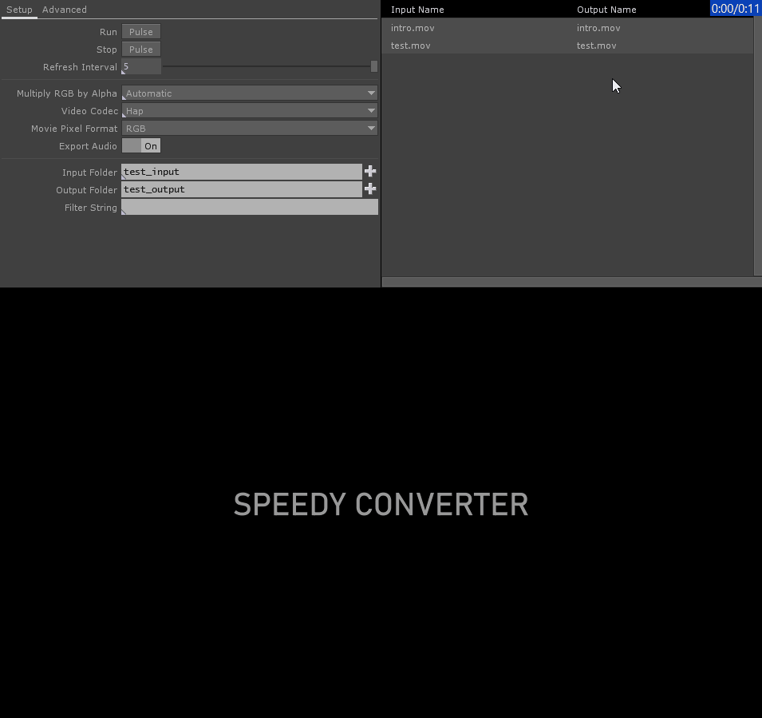

# Speedy Converter

*Tested with TD 2021.14360*

Speedy is designed to be super fast yet simple batch video converter build using TD. It is primarily aimed at conversion to HAP, HAPQ and NotchLC codecs, but could be easily customized by diving in and exposing additional parameters for custom needs.

Speedy is based on concepts used in [Quick Fast Hurry HAPQ Converter](https://github.com/EnviralDesign/Quick-Fast-Hurry-HAPQ-Converter), however with various changes made to conversion process:
1. proper audio & video sync
2. frame guarantee - each frame from input video is encoded to output video (without duplicates), resulting in equal lengths of input and output video
3. UI for hand-picking videos for conversion (select entire folder with `ctrl + a` or pick specific videos)
4. editing output names
5. overwrite warnings (yellow warning indicates that running conversion will overwrite already existing file)

Why does it run so fast? Because these codecs are designed to be very performant and efficient (in terms of CPU and GPU) and also because TD devs have spent tremendous time optimizing their implementation :blush:. Speedy uses philosophy of `QFH HAPQ Converter` and displays refreshed video frame in large intervals while render is running at high frame rates in the background (without overhead of drawing every frame).

> Note: Use `alt + hover` to show help for certain parameters.

> Tip: If you would like to rename files, do it before you select desired videos for conversion (updating row will deselect it).

